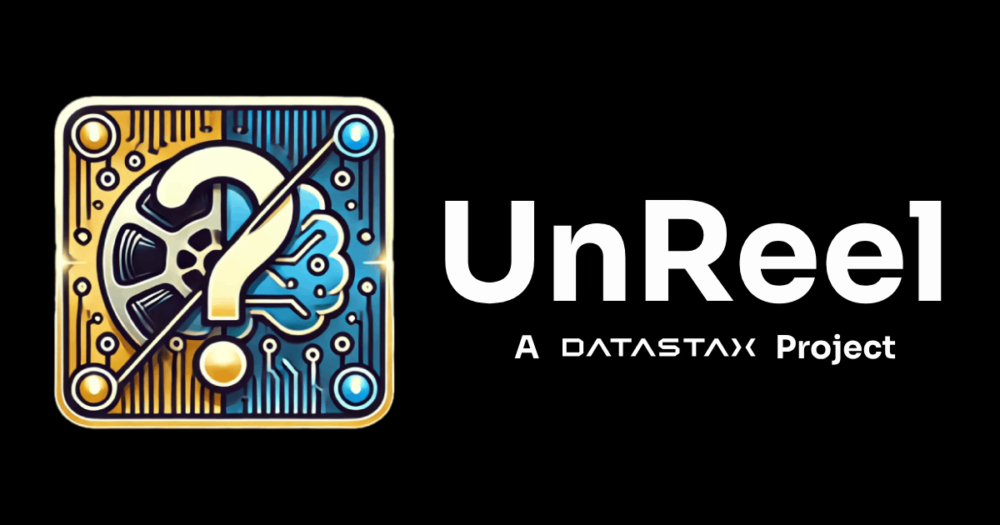

# UnReel

> ⚠️ This is a proof-of-concept and a research project under rapid and heavy development. It is nowhere near finished and was just started. To get up to speed, please read the [design doc](https://www.tldraw.com/ro/bJJ_oD7wKaF0GoDq5Lryv?d=v322.64.1732.1073.page).

This application explores what the above described application's UI might look like. It is a faux-monorepo with 2 directories: `ui` and `controller`.

- `ui` is a React app that is styled with Tailwind CSS and connects to a PartyKit server for real-time communication.
- `controller` is a PartyKit server that manages the game state and communicates with the UI.

These components are connected but are intended to be deployed separately:

- the PartyKit server via `npx partykit deploy` in the `controller` directory to deploy to PartyKit Cloud (an abstraction on Cloudflare), and
- the React app via Vercel in the `ui` directory.

## Running Locally

To run this locally,

1. Clone the repo.
2. `cd` into each directory (`controller` and `ui`) and run `pnpm install` to install the dependencies.
3. Run `npx partykit dev` in the `controller` directory to start the PartyKit server.
4. Run `pnpm dev` in the `ui` directory to start the Astro app.

Both components should now be running locally and support live reloads.

> ⚠️ It's important to speak to localhost over https, not http, because the PartyKit server uses websockets which require https. The project already serves traffic over https on localhost.

### Type-safety

The `common` directory contains shared types between the `ui` and `controller` components. Here's how they're used:

- In our React app in `ui`, we augment the PartyKit client with a custom dispatch function that allows us to strongly type the messages we send to the server. This is `ws.dispatch`.

- In the `controller` component, the server class has 2 methods: `broadcastToAllClients` and `broadcastToSingleClient`, both of which are type safe.

- For future applications, you can use types exported from `./common/events.ts` to type your server I/O, and extend that as necessary.

All of this is essential to an application that works predictably and safely, allowing for safe and fast development.

## Current Status

- The `ui` and `controller` components are complete.
- The movie quotes are static and not yet coming from Langflow because we receive just 1 quote (we need 10). The Langflow flow is [here](https://astra.datastax.com/langflow/e65ec194-7211-4d3f-8d19-4eea47fc581b/flow/d8037b84-a0d3-4fb1-9292-a32ea7874b4b) and we'll switch it over as soon as it works as required.
- We intend to have a scoreboard connected to `controller` on a separate TV as a separate web application that will be connected to the same PartyKit server. Please create a new directory called `scoreboard` to start working on this.

### To Do

If this proves the concept and can work, the next steps are:

- [x] Get a movie quote in response to the start event from the admin panel.
- [x] Display the quote on each connected client.
- [x] Display options for each member's device in a team. Options must be:
  - [x] 2 plausible but wrong answers.
  - [x] 1 correct answer.
  - [x] "AI Generated"
- [x] Recognize when only 1 client in a room has their phone facing upward within a time period.
- [x] Submit the answer when only 1 client in a room has their phone facing upward, or when the time runs out.
- [x] Update the score per room that finishes (`isCorrect * (timeRemaining + 1)`).
- [ ] Display the scores for each room on a separate display (maybe a separate project, maybe another Astro app in this "monorepo").
- [x] Go to the next round (we have a total of 10 rounds).
- [x] After the last round, add a "Game Over" screen that shows the winner and the scores.
